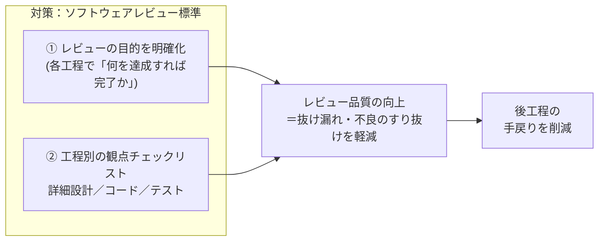

# レビュー品質を上げて“手戻り”を減らす

設計・実装の不備がレビューをすり抜けると、後工程で大きな手戻りになる。
レビューでの **抜け漏れ／不良のすり抜けを減らす＝レビューの品質を上げる** ことで、手戻りを削減する。

| レビュー | 目的＝達成すべき状態（完了基準） | 主な観点（チェックリスト） |
|---|---|---|
| 詳細設計 | 実装者が迷わず実装でき、テスト担当がテストケースを作成できる状態 | 設計品質／責務／例外処理／データ設計／保守性 |
| コード | 設計どおりに実装され、保守性・性能・セキュリティに重大な問題がない状態 | 可読性／保守性／性能／セキュリティ／バグ |
| テスト | 品質を説明できるテストケースがある状態 | 網羅性／正常系／異常系／境界値／期待結果 |

> **目的を明確にし、工程ごとの観点で漏れなく見る** — すり抜けを上流で潰し、手戻りを削減する。
