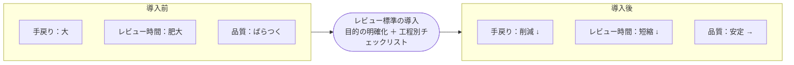

# レビュー標準の導入効果 — ビフォー／アフター

レビューの **目的を明確化** し、**工程別の観点チェックリスト** で漏れなく見ることで、
**手戻り・レビュー時間・品質のばらつき** が改善する。

| 観点 | 導入前（Before） | 導入後（After） |
|---|---|---|
| **手戻り** | 設計・実装の不備がレビューをすり抜け、後工程で大きな手戻りが発生 | 抜け漏れ・不良を上流で発見し、後工程の手戻りを削減 |
| **レビュー時間** | 目的が曖昧で議論が発散。指摘→修正の往復が増え、時間が肥大化 | 見る観点が定まり論点が明確。すり抜け減で再レビューも減少 |
| **品質のばらつき** | レビュアーごとに見る観点が異なり、レビュー品質が安定しない | 工程別チェックリストで観点が揃い、レビュー品質が安定 |

> **目的を明確にし、工程ごとの観点で漏れなく見る** — すり抜けを上流で潰し、手戻り・時間・ばらつきを同時に改善する。
