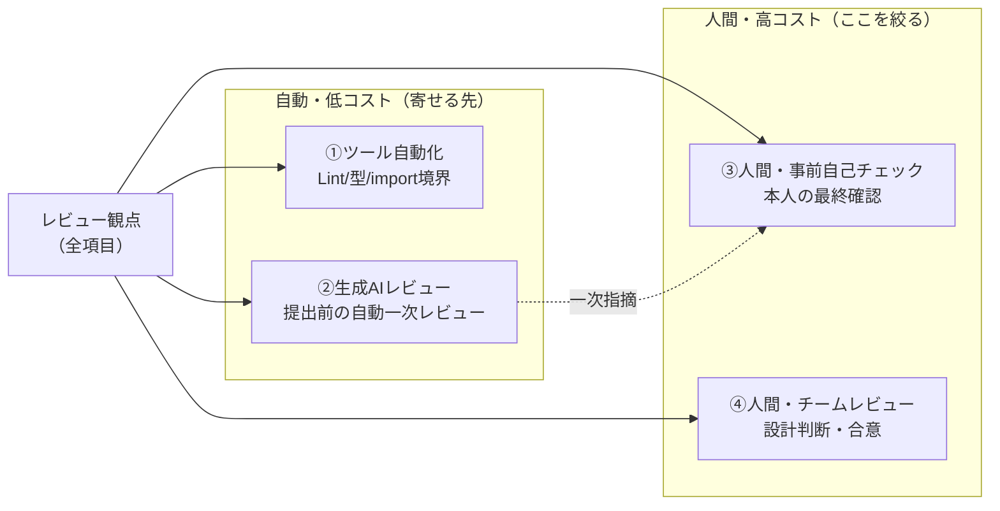

# 生成AIで“人間レビュー”を絞る — 4層の仕分け

観点を **確認の担い手** で4層に仕分け、機械的・定型的な確認を **ツール（①）と生成AI（②）** へ寄せる。
**人間が見るのは③④（判断・合意の項目）だけに絞り**、レビュー時間と属人性を下げる。

| 層 | 担い手 | 確認の例 | 人間の関与 |
|---|---|---|---|
| **①ツール自動化** | CI／静的解析 | Lint・型・import依存方向・空catch | なし |
| **②生成AIレビュー** | 生成AI（提出前） | VO不変性・命名の一次評価・観点の網羅漏れ・設計書との整合 | なし（指摘を本人が解消） |
| **③人間・事前自己チェック** | 提出者本人 | AIの誤検知の取捨・設計意図の最終確認 | 軽い |
| **④人間・チームレビュー** | チーム | 粒度・トレードオフ・網羅の十分性・命名の合意 | ここに集中 |

> **効果**：人間が見る観点項目を各工程で約 **6〜7割削減**（詳細設計 28→約8／コード 20→約6／テスト 20→8）。
> 機械的な確認は①②に任せ、**人間は「判断・合意」だけに集中**する。生成AIは一次レビュー、**最終責任は人間**。
